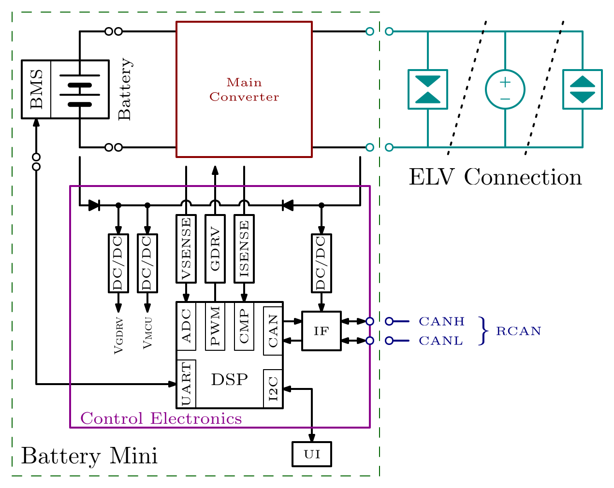
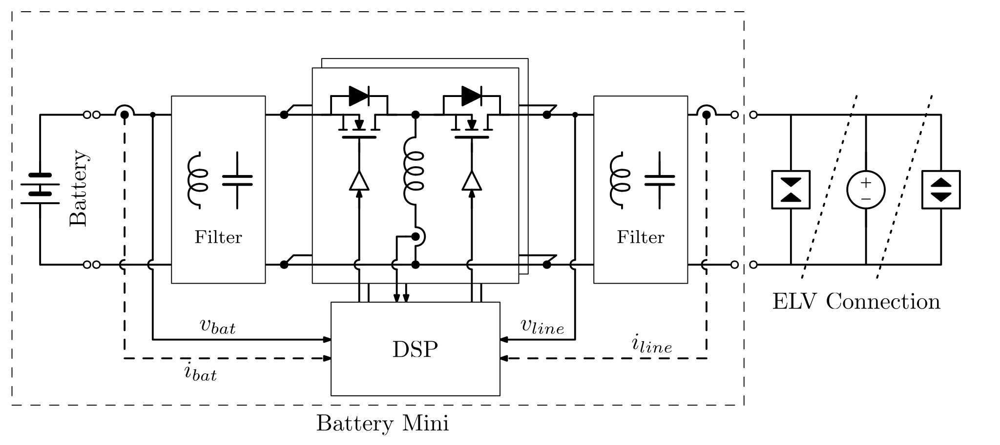
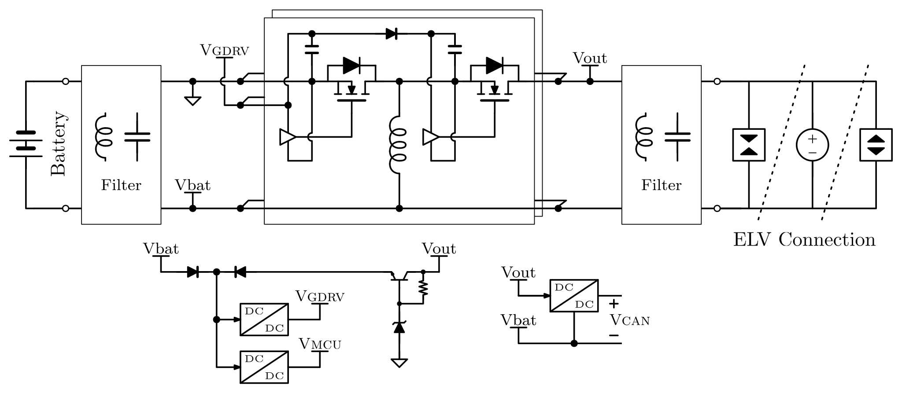
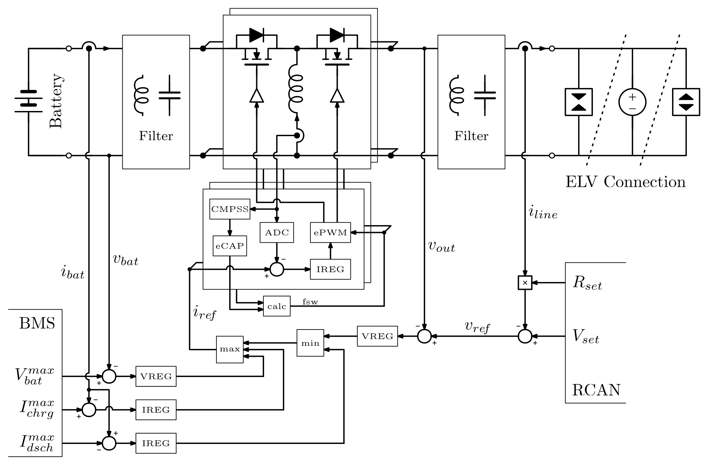

# Battery Mini

> [!note]  
> Reviewed by LazarusMagnus on 17/04. Previous discussion kept inside hidden comments.

<!-- 18/04/2026 
> [!caution]  
> 
Reviewed by LazarusMagnus on 14/04. Comments given in red. General opinion: Beyond cosmetic things, I think that more effort should be placed on defining operating conditions and coordination between multiple grid-forming converters in order for the system to function properly under a wide range of operating conditions (e.g., no generation, excess generation with batteries fully charged, excess generation with batteries not fully charged, etc.). In my opinion, establishing these requirements upfront will reduce the number of iterations needed later during full system integration.

> [!tip]  
>  Reply below by filipcve in green with a tip tag. Marked things that still need looking into with an important tag and magenta color. 
-->
## 1. Requirements

### 1.1. Context

#### [info] Context Block Diagram  

#### [info] ELV Connection
The ELV Connection, as show in the [Context Block Diagram](#info-context-block-diagram), is a two wire electrical connection to an extra-low-voltage (ELV) line, nominally at 48V. As explained in chapter below, it is supplied by Battery Mini and/or other devices connected to the same line.

<!-- 18/04/2026 
> [!caution]  
> I would add a bit of clarification for electrical connection to keep it less abstract. Something like: *two wire dc line nominaly at 48V*. Part *formed by either battery mini or other device*, should be better explained later.

> [!tip]  
>  Added clarification. 
-->
#### [info] Battery
The Battery, as show in the [Context Block Diagram](#info-context-block-diagram), is an electrochemical energy storage device, optionally provided as part of Battery Mini, which can be detached from Battery Mini for use elsewhere (e.g. in a light electric vehicle). It can be charged and discharged by Battery Mini, i.e. it provides energy storage through Battery Mini to the [ELV Connection](#info-elv-connection). It has an integrated battery management system (BMS) and a communication interface through which it informs Battery Mini about its capabilities and status.

<!-- 18/04/2026 
> [!caution]  
>  Conditions and reasons for detachment should be clarified, like *detached (i.e. for usage in electro mobility)*. Also what happens to the system when battery is detached, can it continue to function and under what conditions? 

> [!tip]  
>  Added clarification. The system can continue to function in case another source is attached to the ELV line. It would be off-topic and clunky to explain that here in my opinion. It will be explained in the system architecture and the requirements of other components. 
-->
#### [info] Rosef CAN Bus
The Rosef CAN Bus (RCAN), as show in the [Context Block Diagram](#info-context-block-diagram), is a two wire electrical connection to a CAN bus line, through which communication to other devices connected to the same [ELV Connection](#info-elv-connection) is possible and can be used to coordinate power transfer.

### 1.2. General Requirements

#### 1.2.1. Control ELV  
Battery Mini shall be able to control the voltage of the [ELV Connection](#info-elv-connection) to any setpoint between 46V and 50V.

Note: This functionality is limited by the power that the [Battery](#info-battery) can sink or provide, as well as the [Nominal Power](#125-nominal-power-bidirectional) of Battery Mini itself.

<!-- 18/04/2026 
> [!caution]  
>  Maybe better call it grid forming operation to be consistant with previously used therminology.
Nominaly it can balance the excess and shortage in power by charging and discharging the battery, but what happens when battery is fully discharged or charged. 

> [!tip]  
>  Changed wording above and avoided ambiguity here. 
-->
<!-- 20/04/2026 Added 1.3.6 below.
> [!important]  
> How will Battery Mini determine how much power the Battery is capable of sinking or providing? 
-->
#### 1.2.2 Droop Control
Battery Mini shall be able to dynamically determine the voltage setpoint for the [ELV control]{#121-control-elv} dependant on the current supplied to the [ELV Connection](#info-elv-connection).

#### 1.2.3. Connect to ELV  
Battery Mini shall be able to shall be able to start operation with any voltage up to 50V at the [ELV Connection](#info-elv-connection).

#### 1.2.4. Parallel Operation  
Battery Mini shall be able to operate in parallel to another source connected to the [ELV Connection](#info-elv-connection) (e.g. another Battery Mini).
<!-- 18/04/2026 
> [!caution]  
> 
I think this should be widen a bit to inculde coordinated operation among different grid forming converters (features like power sharing, etc..).

> [!tip]  
>  Unless we see a potential impact on the HW, we can define the specifics at a later point and update the requirements then.
-->
#### 1.2.5. Nominal Power (Bidirectional)  
Battery Mini shall be able to transfer at least 600W of power continuously between the [Battery](#info-battery) and the [ELV Connection](#info-elv-connection) in both directions.

Note: Actual power limited by battery depending on its state of charge. 

<!-- 20/04/2026 Added 1.2.6 below.
> [!important]  
>  How will Battery Mini determine state of charge or in general power capacity of the battery? 
-->
#### 1.2.5. Rosef CAN Communication  
Battery Mini shall communicate with other devices connected to the same [Rosef CAN Bus](#info-rosef-can-bus) according to the [Rosef CAN Specification](https://github.com/Rosef-Engineering/requirements-and-architecture/tree/main/system/RCAN/).

#### 1.2.6. Communication Interface for UI
Battery Mini shall have a communication interface dedicated for connecting to a user interface for displaying information to the user and accepting input from the user.

### 1.3. Battery

#### 1.3.1 Maximum Battery Voltage
Battery Mini shall be able to operate with any [Battery](#info-battery) voltage up to 63V.

#### [info] Nominal Li-ion Battery Voltage
Since the maximum voltage of a lithium ion battery cell is 4.2V, and the nominal voltage is 3.7V, the maximum nominal battery voltage is 63V/4.2*3.7 = 56V (i.e. up to 15 cells in series).

<!-- 18/04/2026 
> [!caution]  
>  Add a clarification to formula so that you state that we will have 15 series cells. 

> [!tip]  
>  Added clarification.
-->
#### 1.3.2. Minimum Battery Voltage
Battery Mini shall be able to transfer the [Nominal Power](#125-nominal-power-bidirectional) continuously with any [Battery](#info-battery) voltage down to 30V.

#### 1.3.3. Battery Recovery
Battery Mini shall be able to charge a connected [Battery](#info-battery) even if it has been fully discharged down to 0V.

<!-- 18/04/2026 
> [!caution]  
>  I would add another point: *ensuring proper battery charge cycle with CC and CV charging modes*. 

> [!tip]  
>  Added requirements below. Unless we see a potential impact on the HW, we can define other details at a later point and update the requirements then.
-->

#### 1.3.4. Control Battery Current
Battery Mini shall be able to control the [Battery](#info-battery) current.

<!-- 20/04/2026 Added 1.2.6 below.
> [!important]  
>  How will Battery Mini determine the current limit for charging/discharging? 
-->
#### 1.3.5. Control Battery Voltage
Battery Mini shall be able to control the [Battery](#info-battery) voltage (for CV charging phase).

<!-- 20/04/2026 Added 1.2.6 below.
> [!important]  
>  How will Battery Mini determine the voltage for CV charging? 
-->
#### 1.3.6. Communicate with BMS  
Battery Mini shall have a communication interface dedicated for exchanging information with the battery managment system (BMS) of the attached [Battery](#info-battery) (e.g. maximum charge and discharge currents, CV charging voltage, etc.).  

## 2. Architecture

### Power Stage Concept

### Auxiliary Power Supply Concept

### Converter Control Concept

