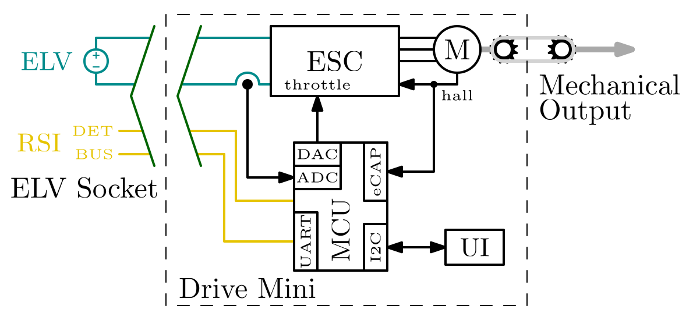

# Drive Mini

## Requirements

### 1.1. Context

#### [info] Context Block Diagram  

#### [info] ELV Socket
The ELV Socket, as show in the [Context Block Diagram](#info-context-block-diagram), is a four wire electrical connection to an extra-low-voltage (ELV) line, nominally at 48V, and a Rosef Serial Interface (RSI), a communication interface enabling exchange of information about available power among other things. In general, the ELV Socket is the power input for Drive Mini, though in certain use cases, power can flow in the opposite direction as well.

#### [info] Mechanical Output
The Mechanical Output, as show in the [Context Block Diagram](#info-context-block-diagram), is a shaft which can be coupled to a mechanical load (e.g. through a chain, belt or gears).

### 1.2. General Requirements

#### 1.2.1 Input Voltage  
Drive Mini shall be able to operate with any input voltage from 46V to 50V at the [ELV Socket](#info-elv-socket).

#### 1.2.2 Output Torque  
Drive Mini shall be able to provide at least ±4Nm at the [Mechanical Output](#info-mechanical-output).

#### 1.2.3. Output Power  
Drive Mini shall be able to provide at least 600W of power continuously to the [Mechanical Output](#info-mechanical-output).

Note: Actual power limited by the power available from the [ELV Socket](#info-elv-socket). 

#### 1.2.4. Reverse Power  
Drive Mini shall be able to transfer up to at least 600W of power from the [Mechanical Output](#info-mechanical-output) to [ELV Socket](#info-elv-socket).

Note: This functionality is limited by the power that the [ELV Socket](#info-elv-socket) can sink.

> [!important]  
>  The end user must be properly warned about the note above! 

#### 1.2.5. Control Output Speed  
Drive Mini shall be able to control the speed of the [Mechanical Output](#info-mechanical-output) to a setpoint specified via user input.

#### 1.2.6. Control Output Torque  
Drive Mini shall be able to control the torque it provides to the [Mechanical Output](#info-mechanical-output) to a setpoint specified via user input.

#### 1.2.7. Control Input Power  
Drive Mini shall be able to control the power it takes from the [ELV Socket](#info-elv-socket) to a setpoint specified via user input.

## Architecture

