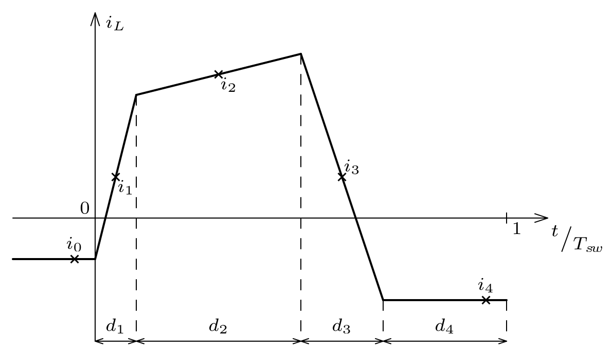

# Battery Mini

## 1. Requirements

## 2. Architecture

### Power Stage Concept

### Auxiliary Power Supply Concept

### Converter Control Concept

$$ i_A = i_1 d_1 + i_2 d_2 $$

### Measurements and Protection Concept

- If possible, we'll use center-pulse-sampling or oversampling and averaging of the inductor current via CT417 (or CT427 if more precision is needed) to determine all currents of interest.

- In case it is not possible, we can use ACS37042 for the input and output currents.

