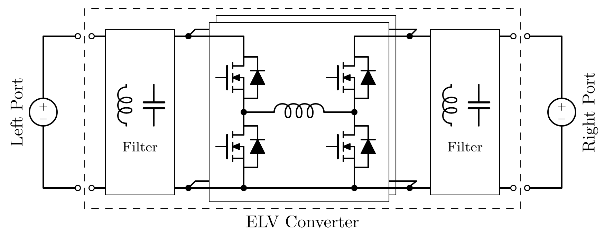
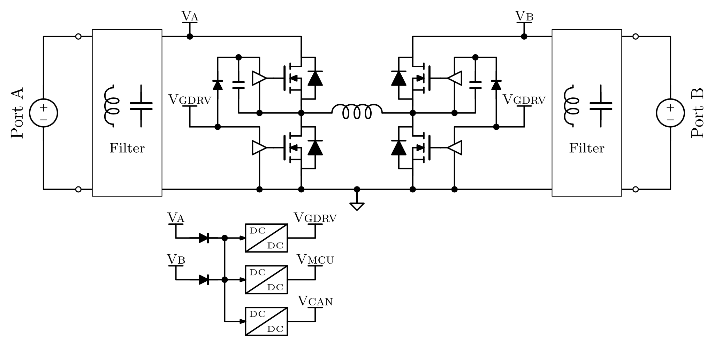
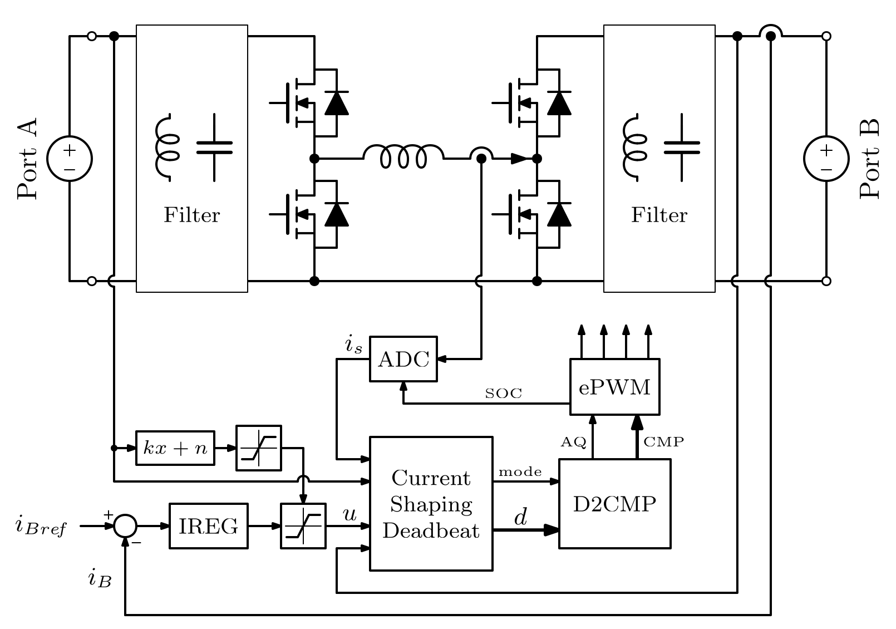
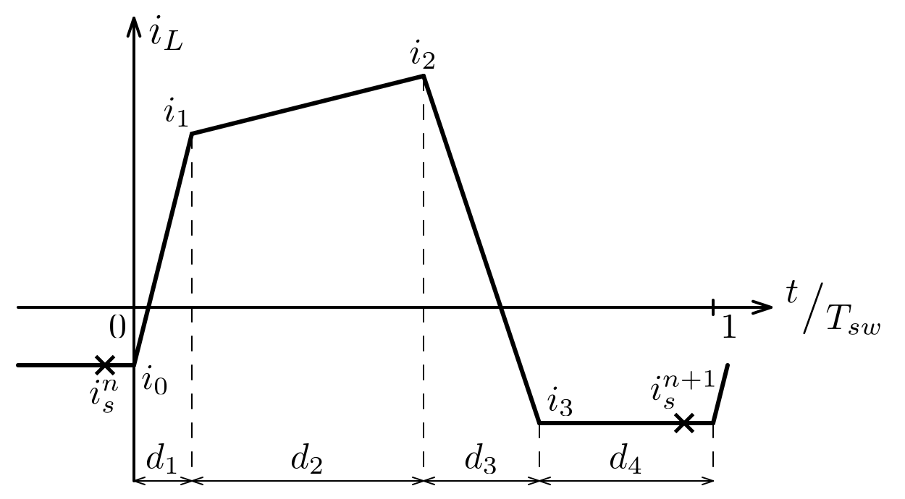
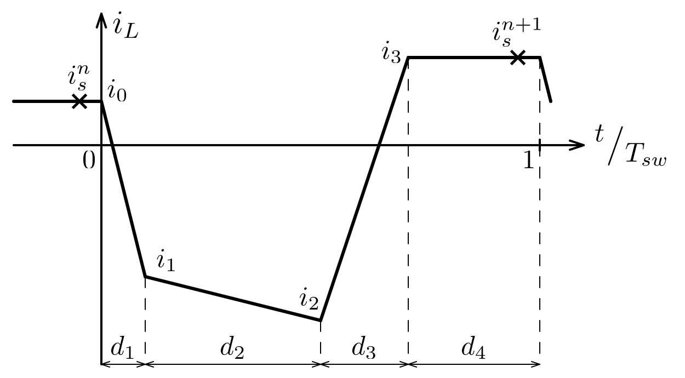
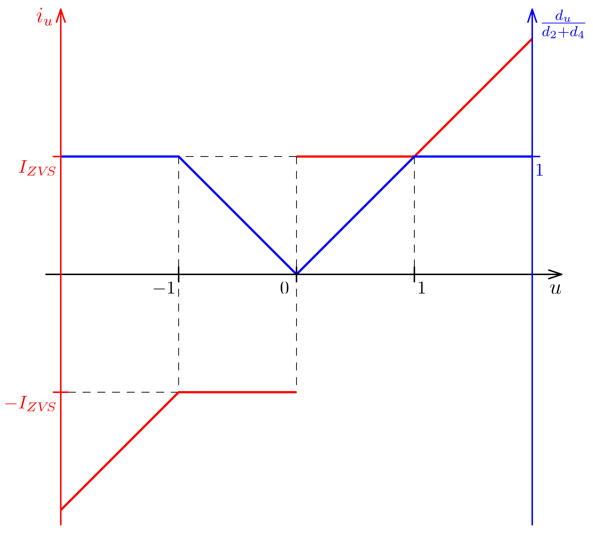
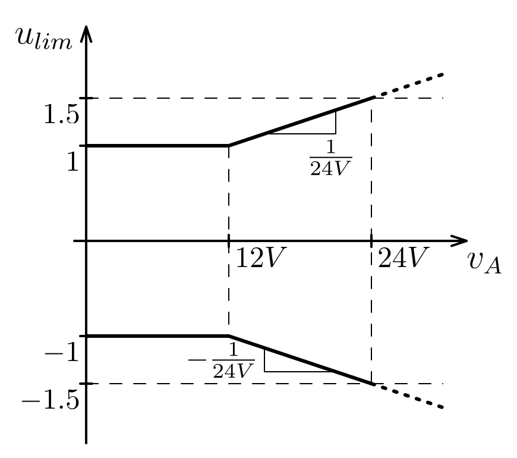
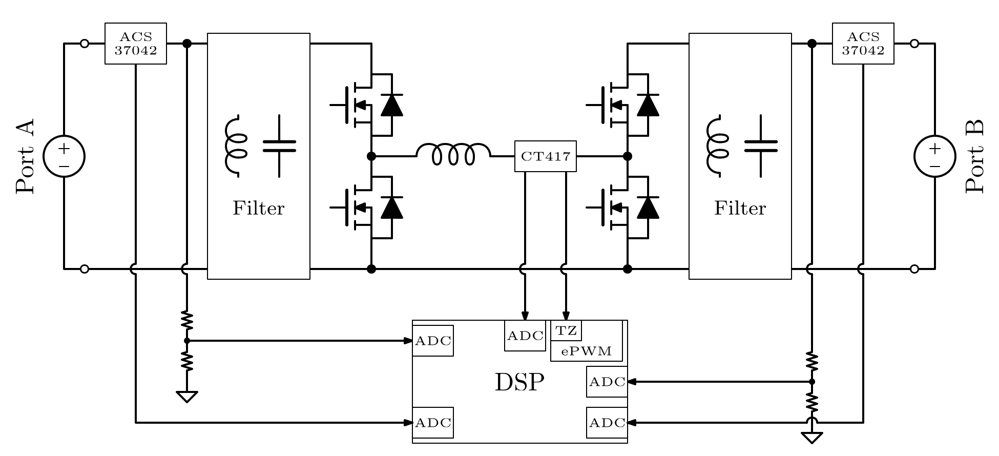

# ELV Converter

## 1. Requirements

## 2. Architecture

### Power Stage Concept

### Auxiliary Power Supply Concept

### Converter Control Concept

- The current $i_u$ in the above graph is the current closer to zero between $i_1$ and $i_2$, i.e. if $sign(u) == sign(v_A-v_B)$, then $i_1 = i_u$, else $i_2 = i_u$.
- The minimum $d_{4min}$ is necessary so that $i_s$ can be sampled with a finite current sensor bandwidth.

### Measurements and Protection Concept

- The inductor current is sampled during $d_4$ via CT417 (or CT427 if more precision is needed) to obtain $i_s$ as necessary for the current shaping deadbeat control.

- The output of the ACS37042 sensors is used to determine the input and output currents.

