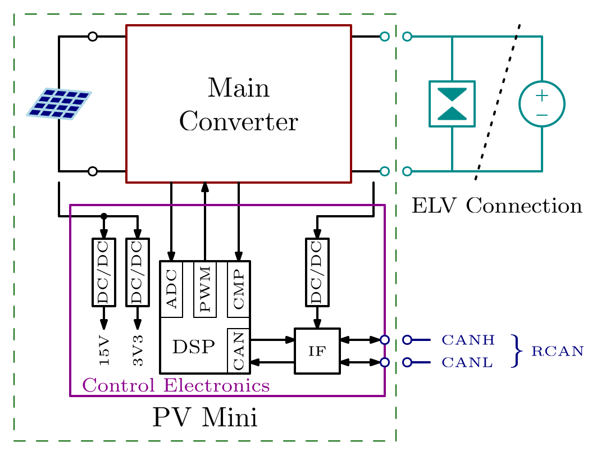

# Solar Mini

> [!caution]  
>  Filip Cvejić reviewed and suggested modifications on 17/04/2026. 

## 1. Requirements

### 1.1. Context

#### [info] Context Block Diagram  

#### [info] ELV Connection
The ELV Connection, as show in the [Context Block Diagram](#info-context-block-diagram), is a two wire electrical connection to an extra-low-voltage (ELV) line, nominally at 48V. As explained in chapter below, it is supplied by Solar Mini and/or other devices connected to the same line.

#### [info] PV Input
The PV Input is a two wire electrical connection to a photovoltaic (PV) source optionally provided as part of Solar Mini, shown on the left side of the [Context Block Diagram](#info-context-block-diagram). The system can work with various input voltages, a single panel or multiple panels connected in parallel.  

> [!caution]  
>  Suggested slight modifications. Removed explicitly stated characteristics - they should be stated below in the requirements only. 

#### [info] Rosef CAN Bus
The Rosef CAN Bus (RCAN), as show in the [Context Block Diagram](#info-context-block-diagram), is a two wire electrical connection to a CAN bus line, through which communication to other devices connected to the same [ELV Connection](#info-elv-connection) is possible and can be used to coordinate power transfer.

### 1.1. General Requirements

#### 1.1.1. MPPT Control  
Solar Mini shall be able to track the maximum power point (MPPT) of the attached [PV Input](#info-pv-input), provided that the available power is within operating limits and that the [ELV Connection](#info-elv-connection) can accept the power.  

> [!caution]  
>  Suggested slight modifications. 

#### 1.1.2. Control ELV
Solar Mini shall be able to control the voltage of the [ELV Connection](#info-elv-connection) to any setpoint between 46V and 50V.

Note: This functionality is limited by the power that the [PV Input](#info-pv-input) can provide, as well as the [Nominal Power](#116-nominal-power) of Solar Mini itself.

> [!caution]  
>  I suggested we keep the same wording as in the Battery Mini requirements, since we're only talking about the ability of Solar Mini, and it would be better to avoid talking about other components. 

#### 1.1.3 Droop Control
Solar Mini shall be able to dynamically determine the voltage setpoint for the [ELV control](#112-control-elv) depending on the current supplied to the [ELV Connection](#info-elv-connection).

> [!caution]  
>  Added this point from Battery Mini, since the same applies here. 

#### 1.1.4. Connect to ELV  
Solar Mini shall be able to shall be able to start operation with any voltage up to 50V at the [ELV Connection](#info-elv-connection).

> [!caution]  
>  Added this point from Battery Mini, since the same applies here. 

#### 1.1.5. Parallel Operation
Solar Mini shall be able to operate in parallel with another source connected to the [ELV Connection](#info-elv-connection) (e.g. another Solar Mini).  

> [!caution]  
>  I would keep this requirement only about parallel operation on the ELV side. We can make a note in the PV Input section explaining that multiple panels can be paralleled at the input. 

#### 1.1.6. Nominal Power
Solar Mini shall be able to transfer up to 600W of power if available from the [PV Input](#info-pv-input), and provided there is a need for that much power in the system.

> [!caution]  
>  Slight modifications; set power to 600W - same as Battery Mini (same HW potentially); removed mention of Battery Mini. 

#### 1.1.6. Rosef CAN Communication
Solar Mini shall communicate with other devices connected to the same Rosef CAN Bus according to the Rosef CAN Specification.

### 1.2. PV Array limits

#### 1.2.1 Maximum input voltage
Solar Mini shall be able to operate with any [PV Input](#info-pv-input) voltage up to 63V.

> [!caution]  
>  I think we should keep it simply and just give a voltage. So I copied the wording over from Battery Mini, I'd say it's good like this. 

#### [info] Nominal Input voltage
Nominal input voltage highly depends on the PV array nominal voltage, weather conditions, and load conditions; it can vary from 20V to 48V.

#### 1.2.2. Minimum Input Voltage
Solar Mini shall be able to operate with any [PV Input](#info-pv-input) voltage down to 10V.

> [!caution]  
>  I think its best if we have one requirement for lowest voltage we can operate with & one for the maximum input current. 

> [!caution]  
>  TO-DO: Add requirement for maximum input current. 

> [!caution]  
>  TO-DO: Add requirement for preventing backflow (inherent in boost and buck-boost topologies, but it should be here nontheless). 

## Architecture

